### Phase 8: Advanced Traffic Analysis & Applied Cryptography

> [!NOTE]  
> **Objective:** To simulate encrypted Command and Control (C2) infrastructure using deceptive cryptographic material, and subsequently utilize deep packet inspection to hunt the malicious beacon within raw network telemetry.

#### Operation 1: Encrypted C2 Emulation & Infrastructure Debugging
* **Red Team Attack:** Engineered an OpenSSL-based HTTPS listener on Kali Linux. Forged a self-signed 2048-bit RSA X.509 certificate deceptively populated with Microsoft Update metadata (`O=Microsoft Corporation, CN=update.microsoft.com`) to bypass rudimentary SOC analyst inspection.
* **Execution & Environmental Troubleshooting:** * **Challenge 1 (API Mismatch):** The initial deployment utilized the `-SkipCertificateCheck` flag, which failed due to the endpoint running legacy Windows PowerShell (v5.1) rather than PowerShell Core. 
  * **Remediation 1:** Engineered a runtime bypass by manipulating the underlying .NET framework directly (`[Net.ServicePointManager]::ServerCertificateValidationCallback = {$true}`) to force the system to blindly trust the rogue CA.
  * **Challenge 2 (Cryptographic Downgrade):** The execution failed a second time because legacy PowerShell defaulted to the deprecated TLS 1.0 protocol, which the modern OpenSSL listener strictly rejected.
  * **Remediation 2:** Forced the session to upgrade its cryptography to modern standards (`[Net.ServicePointManager]::SecurityProtocol = [Net.SecurityProtocolType]::Tls12`).
  * **Outcome:** The payload successfully executed, initiating a secure TLS 1.2 handshake to the adversarial listener before gracefully dropping the connection.

#### Operation 2: Deep Packet Inspection & Threat Hunting
* **Blue Team Defense:** Executed raw wire capture (`tcpdump`) during the C2 beaconing phase. Ingested the resulting PCAP into Wireshark for forensic analysis.
* **Analysis & Signal Isolation:**
  * **Initial Hunt:** Applied standard certificate exchange filters (`tls.handshake.type == 11`). Discovered that Windows OS background telemetry (legitimate Microsoft Update traffic) polluted the capture, masking the C2 beacon.
  * **Refined Hunt:** Engineered a highly specific display filter (`ip.addr == 10.10.1.6 and tls.handshake.type == 11`) to eliminate legitimate internet noise. 
  * **Outcome:** Successfully isolated the malicious TLS handshake and extracted the plaintext deceptive certificate strings prior to cryptographic lock, forensically proving the presence of rogue infrastructure.

#### Operation 3: Automated Threat Detection at Scale (Zeek)
* **Blue Team Defense (Automated):** Transitioned from manual packet inspection to automated protocol analysis using Zeek. 
* **Detection Engineering:** Parsed the resulting `x509.log` using `zeek-cut` and developed a custom `awk` pipeline (`awk -F '\t' '$1 == $2'`) to mathematically identify self-signed certificates by isolating rows where the `certificate.issuer` string perfectly matched the `certificate.subject` string.
* **Outcome:** Successfully filtered out thousands of legitimate TLS exchanges and isolated the exact cryptographic signature of the C2 server, alongside known Root CAs (which are inherently self-signed).

[+] View Operation Evidence (C2 Generation & PCAP Dissection)

**C2 Infrastructure Generation (Kali):**
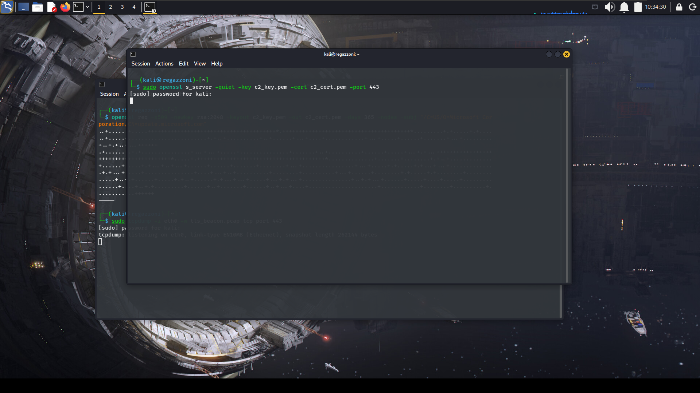

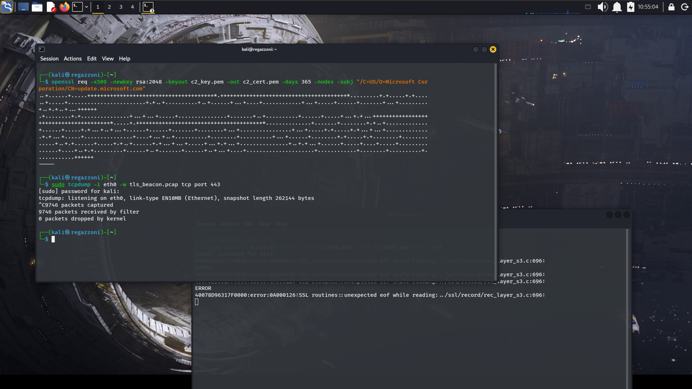

**Malicious Certificate Isolation (Wireshark):**
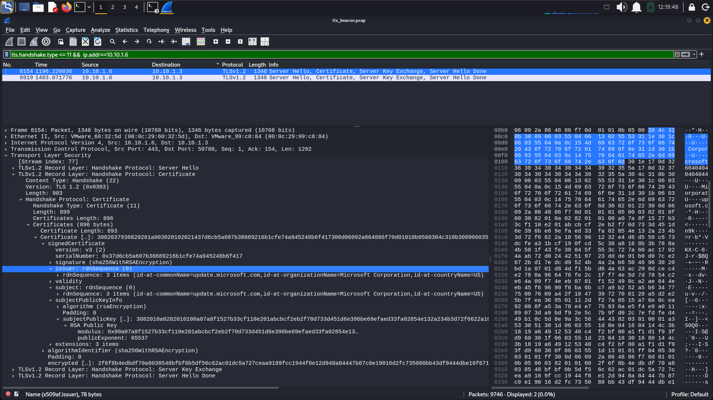

**Automated Zeek Threat Hunting (AWK Pipeline):**
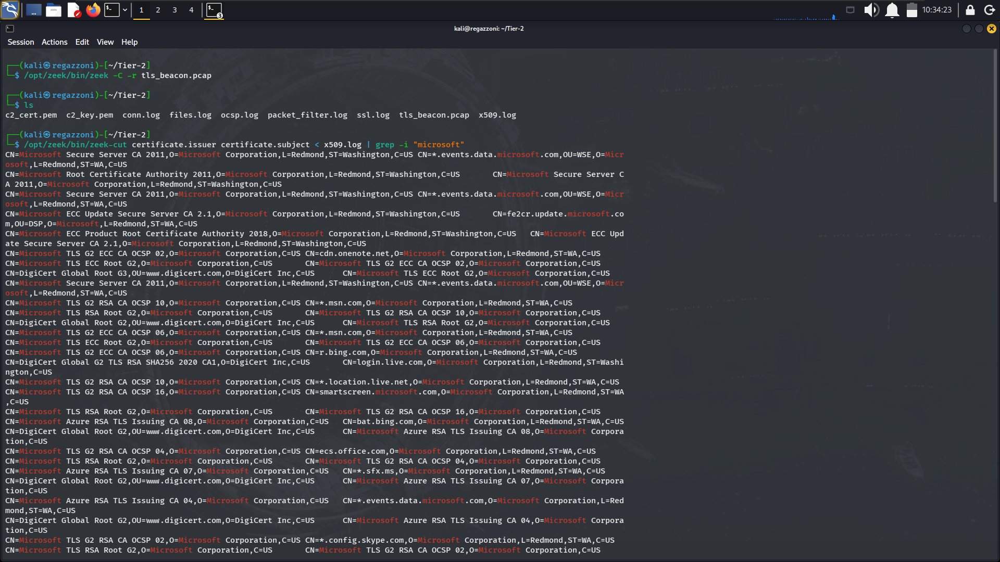

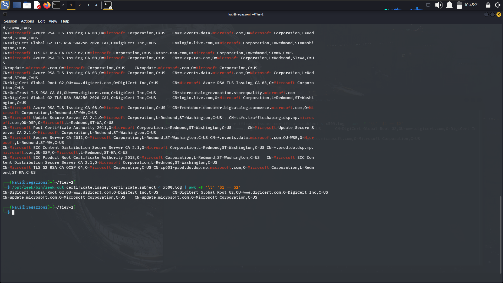

### Phase 9: Enterprise Penetration Testing & Cryptanalysis

> [!NOTE]  
> **Objective:** To exploit legacy network resolution protocols (LLMNR/NBT-NS) via Man-in-the-Middle poisoning, harvest cryptographic authentication material from the wire, and execute offline cryptanalysis to recover plaintext credentials.

#### Operation 1: LLMNR Poisoning & Protocol Abuse
* **Red Team Attack:** Deployed `Responder` on the local subnet to aggressively monitor for failed DNS resolution broadcasts. Simulated an endpoint typo (`\\CorpFinanceServer99`), triggering a fallback to LLMNR/NBT-NS.
* **Execution:** `Responder` successfully intercepted the broadcast, masqueraded as the requested server, and forced the Windows endpoint to automatically negotiate authentication, yielding a valid NetNTLMv2 Challenge/Response hash for the target user.

#### Operation 2: Offline Cryptanalysis
* **Red Team Attack:** Extracted the NetNTLMv2 hash from the raw network capture and sanitized the payload for offline cracking to maintain strict OPSEC and avoid endpoint detection mechanisms (e.g., account lockouts, failed login telemetry).
* **Execution:** Utilized `Hashcat` (Mode 5600) paired with a targeted dictionary attack (`rockyou.txt`) to shatter the HMAC-MD5 cryptography. 
* **Outcome:** Successfully reversed the cryptographic response and recovered the plaintext Active Directory credentials.

[+] View Operation Evidence (Protocol Poisoning)

**LLMNR Poisoning & NetNTLMv2 Capture:**
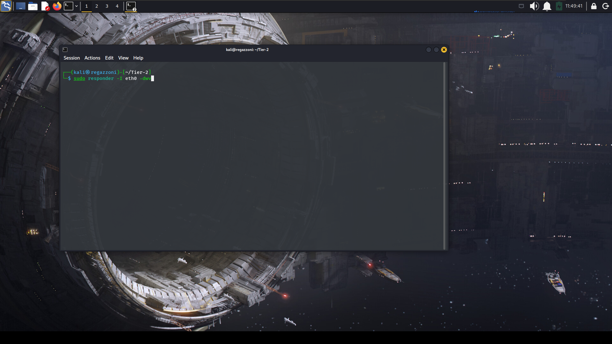

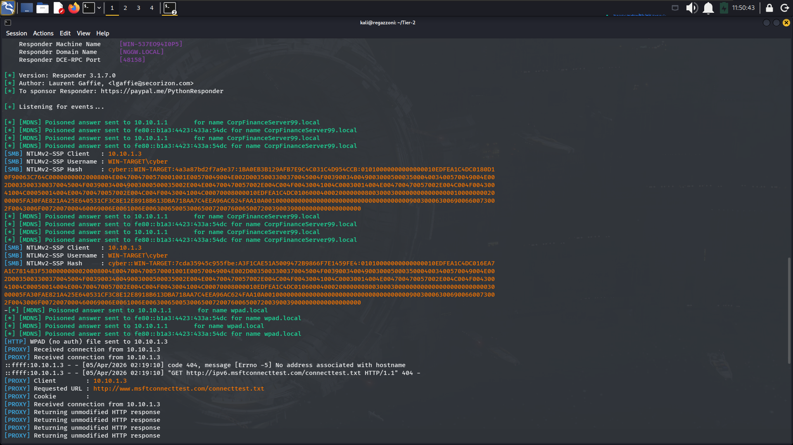

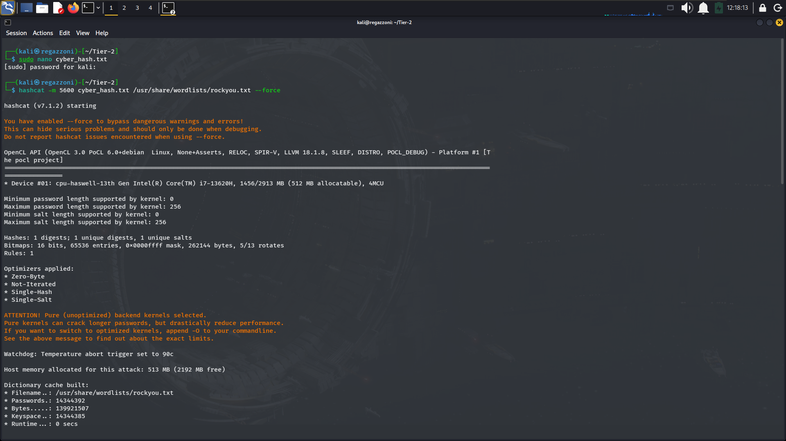
*(Note: Cryptanalysis evidence redacted per OPSEC protocols to protect plaintext credential exposure).*

### Phase 10: Identity Exploitation & Lateral Movement

> [!NOTE]  
> **Objective:** To weaponize recovered plaintext credentials across the enterprise network, map the internal attack surface via authenticated SMB enumeration, and establish Interactive Remote Code Execution (RCE) via WinRM.

#### Operation 1: Protocol Pivoting & Access Verification
* **Execution:** Utilized `NetExec` to validate the cracked credential (`cyber`:`cyber`) against the target endpoint. Initial SMB (Port 445) enumeration revealed valid authentication but zero unauthorized file share access.
* **Adaptation:** Shifted lateral movement tactics to Windows Remote Management (WinRM / Port 5985). The protocol successfully accepted the credential and confirmed Local Administrator privileges (`Pwn3d!`).

#### Operation 2: Interactive Remote Code Execution
* **Execution:** Deployed `Evil-WinRM` to establish a persistent, interactive PowerShell session directly from the Kali attack infrastructure to the Windows endpoint.
* **Outcome:** Successfully bypassed external protections, gained an interactive shell, and verified administrative token assignment (specifically `SeDebugPrivilege` and `SeTakeOwnershipPrivilege`), enabling advanced post-exploitation memory access.

[+] View Operation Evidence (WinRM Shell)

**WinRM Lateral Movement Verification:**
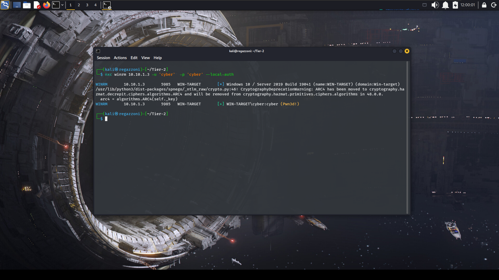

**Interactive RCE & Token Verification:**
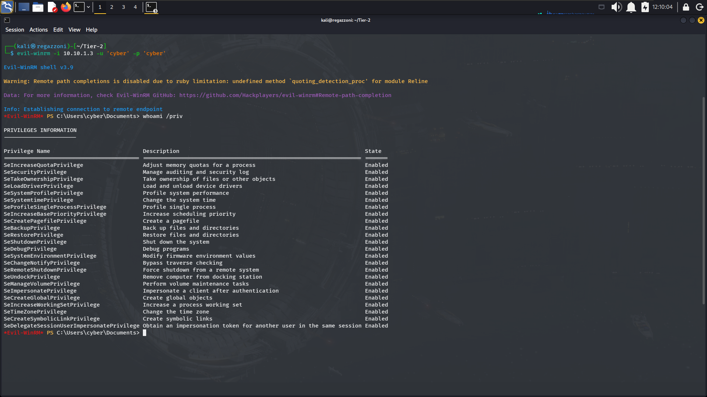

**SAM Hives Save:**
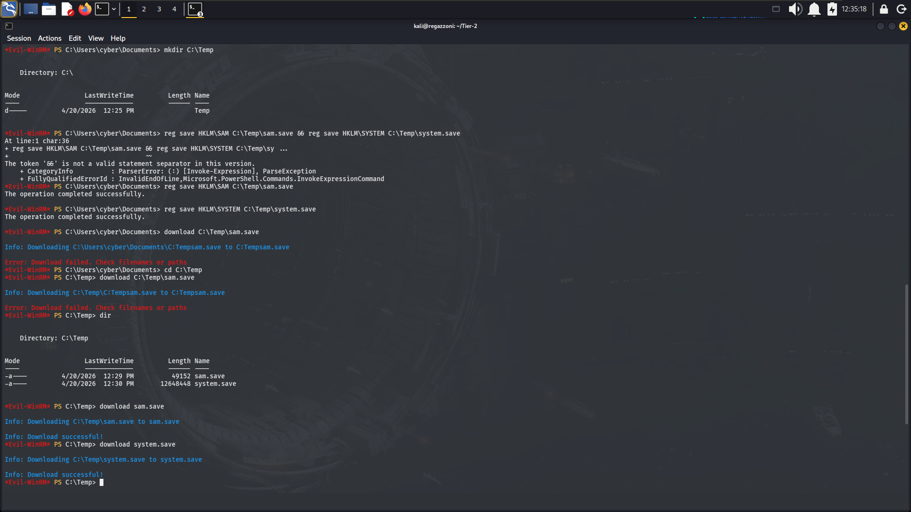

### Phase 11: Enterprise Identity Attacks & Defense

> [!NOTE]  
> **Objective:** To compromise local identity stores, extract cryptographic authentication tokens, and execute network-wide lateral movement via protocol abuse (Pass-the-Hash).

#### Operation 1: Local Security Authority (LSA) Extraction
* **Red Team Attack:** Executed a "Living off the Land" (LotL) technique via WinRM to silently duplicate the encrypted `SAM` and `SYSTEM` registry hives, exfiltrating them to the attack infrastructure to avoid EDR memory-scanning detections.
* **Execution:** Utilized `Impacket-secretsdump` offline to decrypt the SYSTEM boot key and parse the Security Account Manager database, successfully extracting the raw NTLM cryptographic hashes for all local accounts, including the built-in RID 500 `Administrator`.

#### Operation 2: Cryptographic Identity Forgery (Pass-the-Hash)
* **Red Team Attack:** Bypassed plaintext authentication mechanisms entirely by weaponizing the extracted Administrator NTLM hash.
* **Execution:** Leveraged `NetExec` to inject the raw NTLM hash directly into the SMB authentication protocol (`-H` flag). The target server mathematically validated the token, instantly granting `(Pwn3d!)` Local Administrator execution privileges over the network.

[+] View Operation Evidence (Identity Extraction & PtH)

**Offline SAM Decryption & Hash Extraction:**
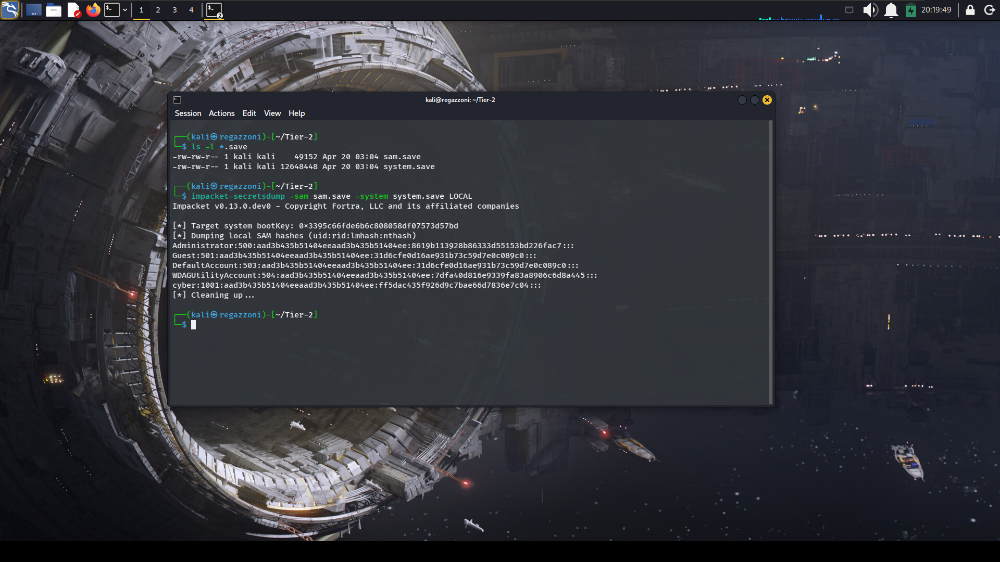

**Pass-the-Hash (PtH) SMB Authentication:**
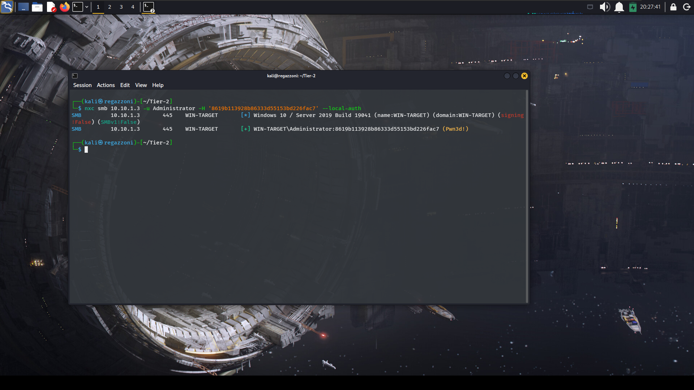

#### Operation 3: Blue Team Defense & Root Cause Analysis
* **Defense Strategy:** Attempted to mitigate Pass-the-Hash by injecting the `FilterAdministratorToken = 1` policy into the LSA registry, theoretically forcing Admin Approval Mode on the built-in RID 500 account over network logons.
* **Outcome:** The architectural defense failed; the endpoint remained vulnerable to PtH `(Pwn3d!)`.
* **Root Cause Analysis (RCA):** Discovered a critical environmental misconfiguration. The master User Account Control (UAC) engine was disabled at the OS level (`EnableLUA = 0`). When UAC is disabled, Windows fundamentally ignores token filtering policies, demonstrating that defense-in-depth requires hierarchical policy enforcement.

> [!NOTE]  
> **Objective:** To architect and deploy a definitive, Tier 2 mitigation against NTLM cryptographic token forgery (Pass-the-Hash) and lateral movement.

#### Operation 4: Architectural Attack Path Severance
* **Defense Strategy:** Abandoned legacy registry band-aids (UAC token filtering) in favor of strict User Rights Assignment hierarchies.
* **Execution:** Deployed the `SeDenyNetworkLogonRight` ("Deny access to this computer from the network") security policy targeting the built-in Local Administrator group.
* **Outcome:** Successfully neutralized the Pass-the-Hash attack vector. The Windows kernel actively rejects valid administrative NTLM hashes presented over SMB, functionally eliminating the primary lateral movement avenue used in enterprise breaches.

[+] View Operation Evidence (Tier 2 Mitigation)

**Deploying SeDenyNetworkLogonRight via Local Security Policy:**
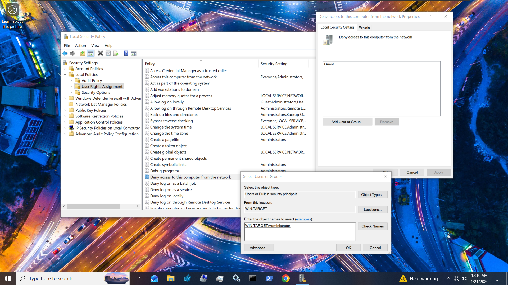

**Red Team Verification (Attack Blocked):**
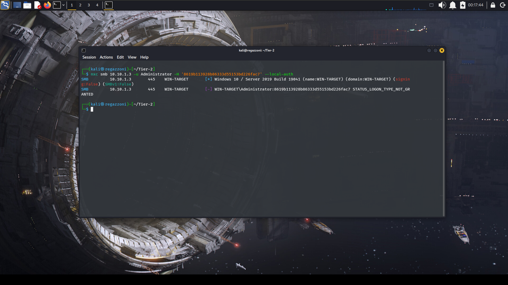

### Phase 12: Tactical Cloud & Kubernetes Security (Purple Team)

> [!NOTE]  
> **Objective:** To architect a cloud-native Kubernetes environment, execute a full kill-chain from container breakout to cluster takeover (Red Team), and engineer vendor-agnostic Detection-as-Code to identify the intrusion (Blue Team).

#### Operation 1: Cloud Infrastructure Provisioning & Environmental Engineering
* **Deployment:** Architected a local Kubernetes cluster utilizing Docker, `kubectl`, Minikube, and Helm.
* **Troubleshooting:** Successfully navigated complex Linux dependency matrices, bypassing interactive `debconf` EULA interruptions, VirtualBox DKMS kernel header panics, and Debian/Kali OS repository mismatches. Dynamically resolved `docker.sock` permission boundaries via active session group manipulation (`newgrp`).

#### Operation 2: Red Team - Container Escape & Host Takeover (MITRE T1611)
* **Execution:** Simulated a compromised web application container suffering from a catastrophic developer misconfiguration (`privileged: true` Pod + `hostPath` volume mount).
* **Impact:** Executed a Linux Namespace bypass via `chroot /host-system /bin/bash`, successfully escaping the isolated container and achieving `root`-level execution on the underlying Kubernetes Worker Node (verified via `/etc/shadow` extraction).

#### Operation 3: Red Team - K8s API Abuse & Identity Privilege Escalation
* **Reconnaissance:** "Lived off the land" by deploying missing network binaries (`curl`) inside the pod to harvest the mounted ServiceAccount JSON Web Token (JWT) from `/var/run/secrets/...` (MITRE T1552.007).
* **The RBAC Wall:** Encountered proper defense-in-depth; the default ServiceAccount triggered a `403 Forbidden` from the API Server, proving that default RBAC successfully contained the blast radius of the container escape.
* **Escalation:** Exploited a simulated over-privileged RoleBinding (`cluster-admin`). Leveraged this identity to bypass RBAC entirely, using `kubectl auth can-i --list` to verify wildcard access, and subsequently dumped `kube-system` bootstrap tokens to achieve total cluster compromise.

#### Operation 4: Blue Team - Detection Engineering & Sigma Rule Authoring
* **Defense Strategy:** Transitioned to Detection-as-Code (SEC555 methodology), authoring a vendor-agnostic Sigma YAML rule targeting unauthorized container administration (MITRE T1609).
* **Execution:** Enforced strict metadata standards by generating RFC-compliant UUIDs for the rule schema. Successfully bypassed `sigma-cli` processing pipeline errors to translate the YAML logic into a highly actionable Splunk SPL query (`Image="*/kubectl"`), ready for immediate SOC deployment.

[+] View Operation Evidence (K8s Red/Blue Operations)

**Container Escape to Host Node (chroot /etc/shadow):**
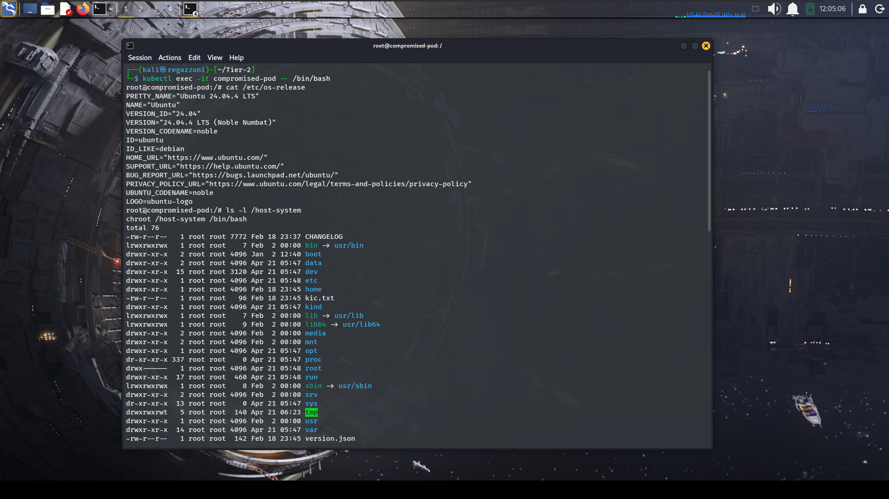

**K8s API Privilege Escalation (Cluster-Admin Token Dump):**
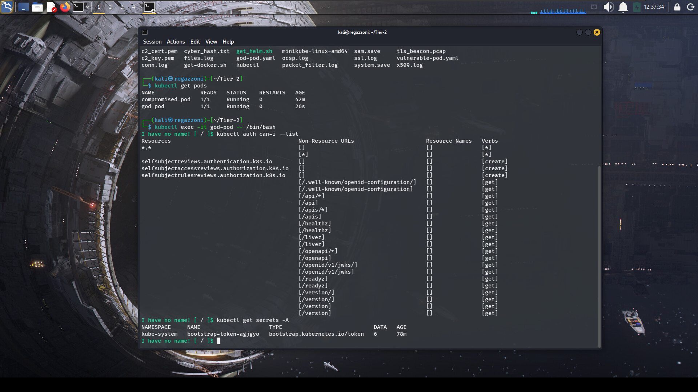

**Detection-as-Code (Sigma to Splunk SPL compilation):**
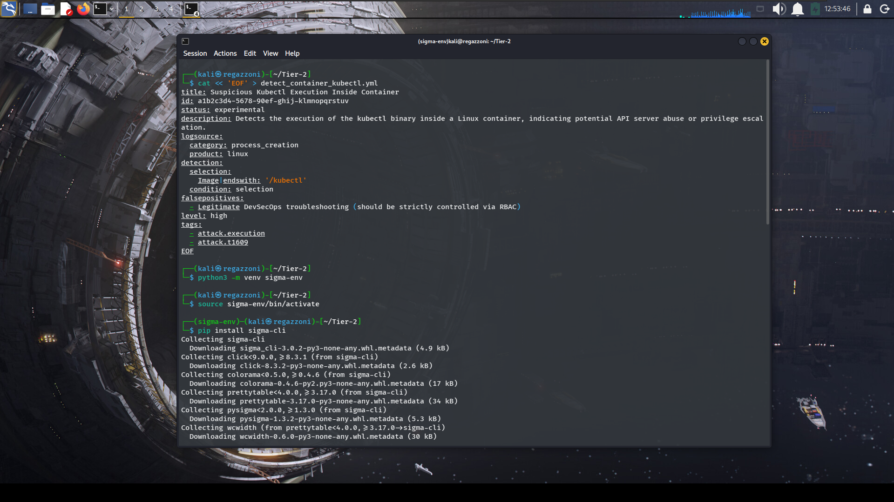
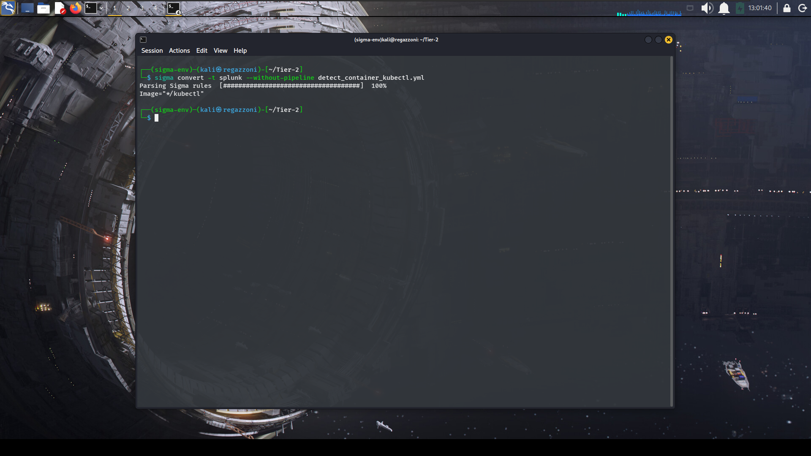

